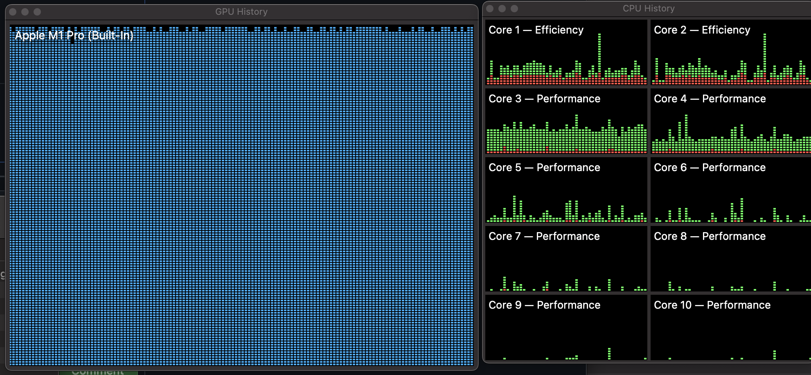

## Diffusion
|No|Title|Open in Studio Lab|Open in Kaggle|Open in Colab|
|---|---|---|---|---|
|1|[Deconstruct the Stable Diffusion pipeline](diffusion/diffusers/deconstruct_the_stable_diffusion_pipline.ipynb)||||
|2|[Basic training model](diffusion/diffusers/basic_training_model.ipynb)||||
|3|[Deconstruct the basic pipeline](diffusion/diffusers/deconstruct_basic_pipeline.ipynb)||||
|4|[Details for models and schedulers](diffusion/diffusers/details_for_models_scheduler.ipynb)||||
|5|[Effective and Efficient diffusion](diffusion/diffusers/effective_and_efficient_diffusion.ipynb)||||
|6|[Generting by using float16(sppeding up)](diffusion/diffusers/generating_by_fp16.ipynb)||||
|7|[Stable Diffusion v1.5 demo](diffusion/diffusers/stable_diffusion_v1_5_demo.ipynb)||||
|8|[Load checkpoints models and schedulers](diffusion/diffusers/load_checkpoints_models_schedulers.ipynb)||||
|9|[Schedulers Performance](diffusion/diffusers/schedulers_performance.ipynb)||||
|10|[Stable diffusion with diffusers](diffusion/diffusers/stable_diffusion_with_diffusers.ipynb)||||

## Implementation
|No|Title|Open in Studio Lab|Kaggle|Open in Colab|Paper|
|---|---|---|---|---|---|
|1|[The annotated diffusion model](implementation/the_annotated_diffusion_model.ipynb)||||[1503.03585](https://arxiv.org/abs/1503.03585),[1907.05600](https://arxiv.org/abs/1907.05600),[2006.11239](https://arxiv.org/abs/2006.11239)|

## PyTorch Fundamentals

* [Basic programming with PyTorch](pytorch/README.md)
* [Computer vision with PyTorch](pytorch/computer_vision/README.md)
* [Natural language processing with PyTorch](pytorch/natural_language_processing/README.md)
* [Audio classification with PyTorch](pytorch/audio_classification/README.md)

## On Kaggle

Many of the notebooks are executed on Kaggle

## On macOS

All the notebooks are support [mps](https://aisuko.gitbook.io/wiki/ai-techniques/large-language-model/metal), except if the notebooks import fp16 speeding up:

* [The kernel crashed](https://github.com/microsoft/vscode-jupyter/issues/13828)

## Contributing

Warm welcome for any contributions, please follow the [contributing guidelines](CONTRIBUTING.md).

## Credit
- [Huggingface diffusers](https://github.com/huggingface/diffusers)
- [Microsoft learning](https://learn.microsoft.com/en-au/training/modules/intro-machine-learning-pytorch/)