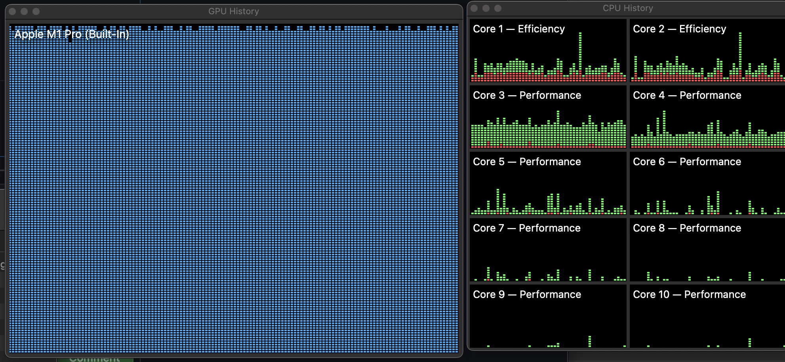

# PyTorch Fundamentals

Learn the fundamentals of deep learning with PyTorch! This beginner friendly learning path will introduce key concepts to building machine learning models in multiple domains include speech, vision, and natural language processing.

* Basic Python knowledge
* Basic knowledge about how to use Jupyter Notebooks
* Basic understanding of machine learning

And if you are interested to know more, please check another repo [Implementation for the different ML tasks on Kaggle platform with GPUs](https://github.com/Aisuko/notebooks).

NOTE: There do have many bugs due to the different version of dependencies, please open new issue to discuss it.

<!-- NOTEBOOKS:START -->
## Notebooks

_Auto-generated from `.ipynb` files. Run `python3 scripts/generate_readme_notebooks.py` to update._

### Causality

|No|Title|Open in SageMaker|Open in Kaggle|Open in Colab|
|---|---|---|---|---|
|1|[Demo for causal head gating](causality/demo-for-causal-head-gating.ipynb)||||

### Diffusion

#### Diffusers

|No|Title|Open in SageMaker|Open in Kaggle|Open in Colab|
|---|---|---|---|---|
|1|[Basic training model](diffusion/diffusers/basic_training_model.ipynb)||||
|2|[Deconstruct basic pipeline](diffusion/diffusers/deconstruct_basic_pipeline.ipynb)||||
|3|[Deconstruct the stable diffusion pipline](diffusion/diffusers/deconstruct_the_stable_diffusion_pipline.ipynb)||||
|4|[Details for models scheduler](diffusion/diffusers/details_for_models_scheduler.ipynb)||||
|5|[Effective and efficient diffusion](diffusion/diffusers/effective_and_efficient_diffusion.ipynb)||||
|6|[Generating by fp16](diffusion/diffusers/generating_by_fp16.ipynb)||||
|7|[Load checkpoints models schedulers](diffusion/diffusers/load_checkpoints_models_schedulers.ipynb)||||
|8|[Loading different sd formats](diffusion/diffusers/loading_different_sd_formats.ipynb)||||
|9|[Schedulers performance](diffusion/diffusers/schedulers_performance.ipynb)||||
|10|[Stable diffusion v1 5 demo](diffusion/diffusers/stable_diffusion_v1_5_demo.ipynb)||||
|11|[Stable diffusion with diffusers](diffusion/diffusers/stable_diffusion_with_diffusers.ipynb)||||
|12|[Using safetensors](diffusion/diffusers/using_safetensors.ipynb)||||

### Paper implementation

|No|Title|Open in SageMaker|Open in Kaggle|Open in Colab|
|---|---|---|---|---|
|1|[Qlora for ft falcon 7b](implementation/qlora_for_ft_falcon_7b.ipynb)||||
|2|[The annotated diffusion model](implementation/the_annotated_diffusion_model.ipynb)||||

### Introduce to PyTorch

|No|Title|Open in SageMaker|Open in Kaggle|Open in Colab|
|---|---|---|---|---|
|1|[About the optimization loop](pytorch/about_the_optimization_loop.ipynb)||||
|2|[Automatic differentiation](pytorch/automatic_differentiation.ipynb)||||
|3|[Building the model layer](pytorch/building_the_model_layer.ipynb)||||
|4|[Load and run model predictions](pytorch/load_and_run_model_predictions.ipynb)||||
|5|[Loading and normalizing datasets](pytorch/loading_and_normalizing_datasets.ipynb)||||
|6|[The full model building process](pytorch/the_full_model_building_process.ipynb)||||
|7|[What are tensors](pytorch/what_are_tensors.ipynb)||||

#### Audio classification with PyTorch

|No|Title|Open in SageMaker|Open in Kaggle|Open in Colab|
|---|---|---|---|---|
|1|[Audio transforms and visualizations](pytorch/audio_classification/audio_transforms_and_visualizations.ipynb)||||
|2|[Understand audio data and concepts](pytorch/audio_classification/understand_audio_data_and_concepts.ipynb)||||

#### Computer vision with PyTorch

|No|Title|Open in SageMaker|Open in Kaggle|Open in Colab|
|---|---|---|---|---|
|1|[Introduction to cv with pytorch](pytorch/computer_vision/introduction_to_cv_with_pytorch.ipynb)||||
|2|[Lightweight networks and mobileNet](pytorch/computer_vision/lightweight_networks_and_mobileNet.ipynb)||||
|3|[Pre trained models and transfer learning](pytorch/computer_vision/pre_trained_models_and_transfer_learning.ipynb)||||
|4|[Training a simple dense neural network](pytorch/computer_vision/training_a_simple_dense_neural_network.ipynb)||||
|5|[Training multi layer convolutional neural network](pytorch/computer_vision/training_multi_layer_convolutional_neural_network.ipynb)||||
|6|[Use a convolutional neural network](pytorch/computer_vision/use_a_convolutional_neural_network.ipynb)||||

#### Natural language processing with PyTorch

|No|Title|Open in SageMaker|Open in Kaggle|Open in Colab|
|---|---|---|---|---|
|1|[Capture patterns with recurrent neural networks](pytorch/natural_language_processing/capture_patterns_with_recurrent_neural_networks.ipynb)||||
|2|[Generate text with recurrent networks](pytorch/natural_language_processing/generate_text_with_recurrent_networks.ipynb)||||
|3|[Represent words with embeddings](pytorch/natural_language_processing/represent_words_with_embeddings.ipynb)||||
|4|[Representing text as tensors](pytorch/natural_language_processing/representing_text_as_tensors.ipynb)||||
<!-- NOTEBOOKS:END -->

# On macOS

All the notebooks are support [mps](https://aisuko.gitbook.io/wiki/ai-techniques/large-language-model/metal), except if the notebooks import fp16 speeding up:

* [The kernel crashed](https://github.com/microsoft/vscode-jupyter/issues/13828)

# Contributing

Warm welcome for any contributions, please follow the [contributing guidelines](CONTRIBUTING.md).

# Acknowledgement

- [Huggingface diffusers](https://github.com/huggingface/diffusers)
- [Microsoft learning](https://learn.microsoft.com/en-au/training/modules/intro-machine-learning-pytorch/)